# Islandora Advanced Search <!-- omit in toc -->

- [Introduction](#introduction)
- [Requirements](#requirements)
- [Installation](#installation)
- [Configuration](#configuration)
- [Configuring Solr](#configuring-solr)
- [Configure Collection Search](#configure-collection-search)
- [Configure Views](#configure-views)
  - [Exposed Form](#exposed-form)
  - [Collection Search](#collection-search)
  - [Paging](#paging)
  - [Sorting](#sorting)
- [Configure Facets](#configure-facets)
  - [Include / Exclude Facets](#include--exclude-facets)
- [Configure Blocks](#configure-blocks)
  - [Advanced Search Block](#advanced-search-block)
- [Documentation](#documentation)
- [Troubleshooting/Issues](#troubleshootingissues)
- [Maintainers](#maintainers)
- [Sponsors](#sponsors)
- [Development](#development)
- [License](#license)

## Introduction

This module creates several blocks to support searching. It also enables the use
of Ajax with search blocks, facets, and search results.

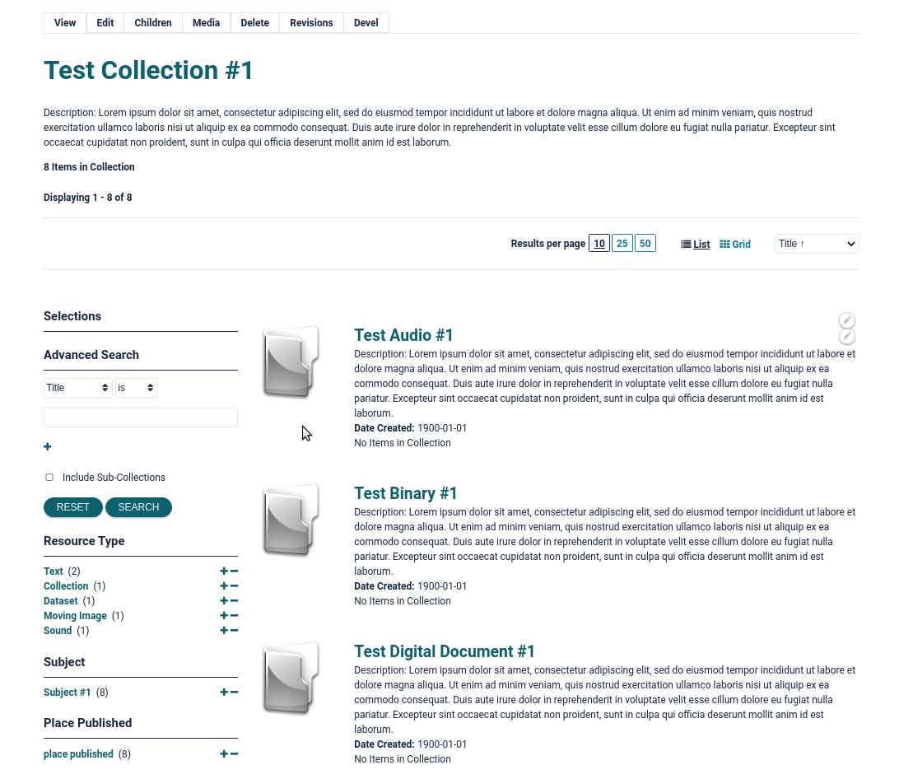

## Requirements

Use composer to download the required libraries and modules.

```bash
composer require drupal/facets "^1.3"
composer require drupal/search_api_solr "^4.1"
composer require drupal/search_api "^1.5"
```

However, for reference, `islandora_advanced_search` requires the following
drupal modules:

- [facets](https://www.drupal.org/project/facets)
- [search_api_solr](https://www.drupal.org/project/search_api_solr)

## Installation

To download/enable just this module, use the following from the command line:

```bash
composer require islandora/islandora
drush en islandora_advanced_search
```

## Configuration

You can set the following configuration at
`admin/config/islandora/advanced_search`:

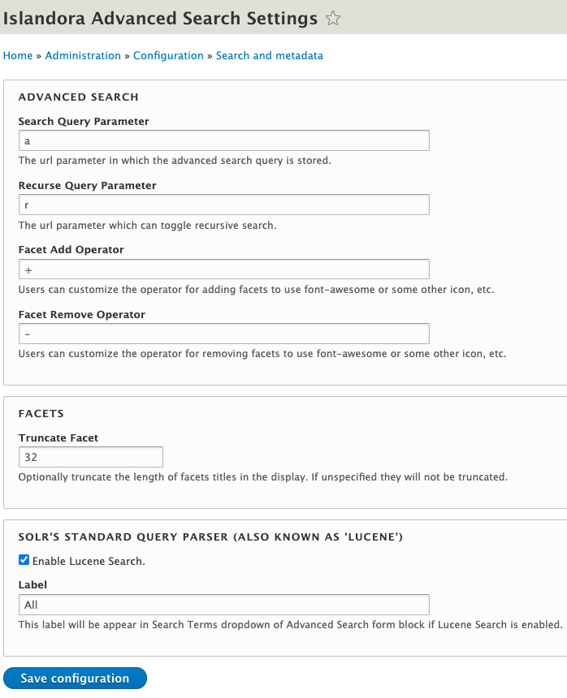

## Configuring Solr

Please review
[Islandora Documentation](https://islandora.github.io/documentation/user-documentation/searching/)
before continuing. The following assumes you already have a working Solr and the
Drupal Search API setup.

## Configure Collection Search

To support collection based searches you need to index the `field_member_of` for
every repository item as well define a new field that captures the full
hierarchy of `field_member_of` for each repository item.

Add a new `Content` solr field `field_decedent_of` to the solr index at
`admin/config/search/search-api/index/default_solr_index/fields`.


Then under `admin/config/search/search-api/index/default_solr_index/processors`
enable `Index hierarchy` and setup the new field to index the hierarchy.

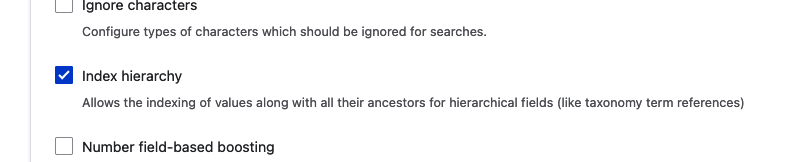

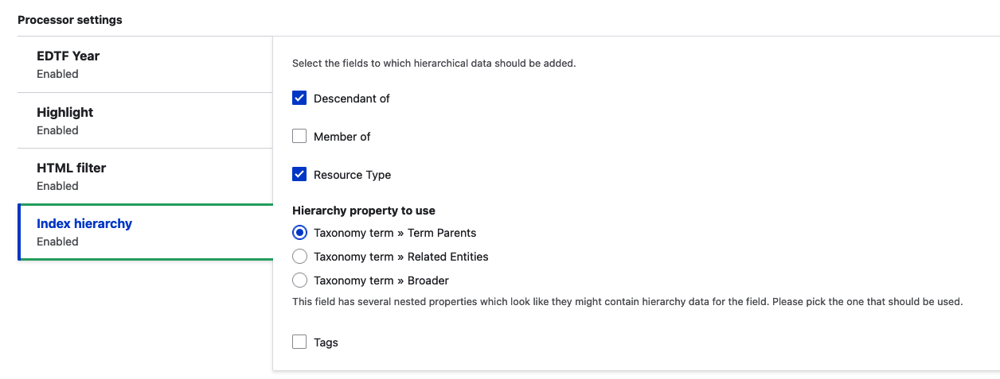

The field can now be used limit a search to all the decedents of a given object.

> N.B. You may have to re-index to make sure the field is populated.

## Configure Views

The configuration of views is outside of the scope of this document, please read
the [Drupal Documentation](https://www.drupal.org/docs/8/core/modules/views), as
well as the
[Search API Documentation](https://www.drupal.org/docs/contributed-modules/search-api).

### Exposed Form

Solr views allow the user to configure an exposed form (_optionally as a
block_). This form / block is **different** from the
[Advanced Search Block](#advanced-search-block). This module does not make any
changes to the form, but this form can cause the Advanced Search Block to not
function if configured incorrectly.

The Advanced Search Block requires that if present the Exposed forms
`Exposed form style` is set to `Basic` rather than `Input Required`. As
`Input Required` will prevent any search from occurring unless the user puts an
additional query in the Exposed form as well.

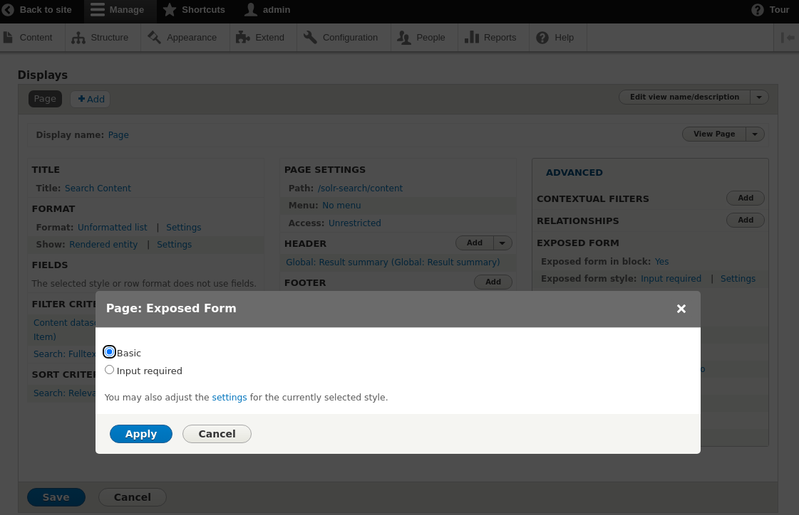

### Collection Search

That being said it will be typical that you require the following
`Relationships` and `Contextual Filters` when setting up a search view to enable
`Collection Search` searches.

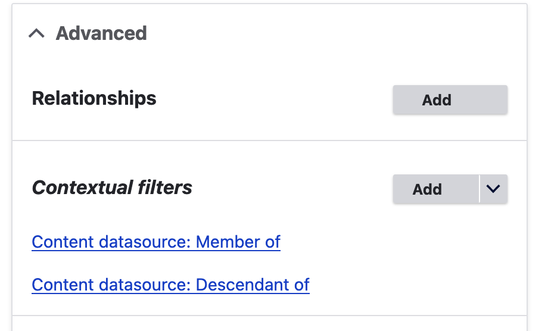

Here a relationship is setup with `Member Of` field and we have **two**
contextual filters:

1. `field_member_of` (Direct decedents of the Entity)
2. `field_decedent_of` (All decedents of the Entity)

Both of these filters are configured the exact same way.

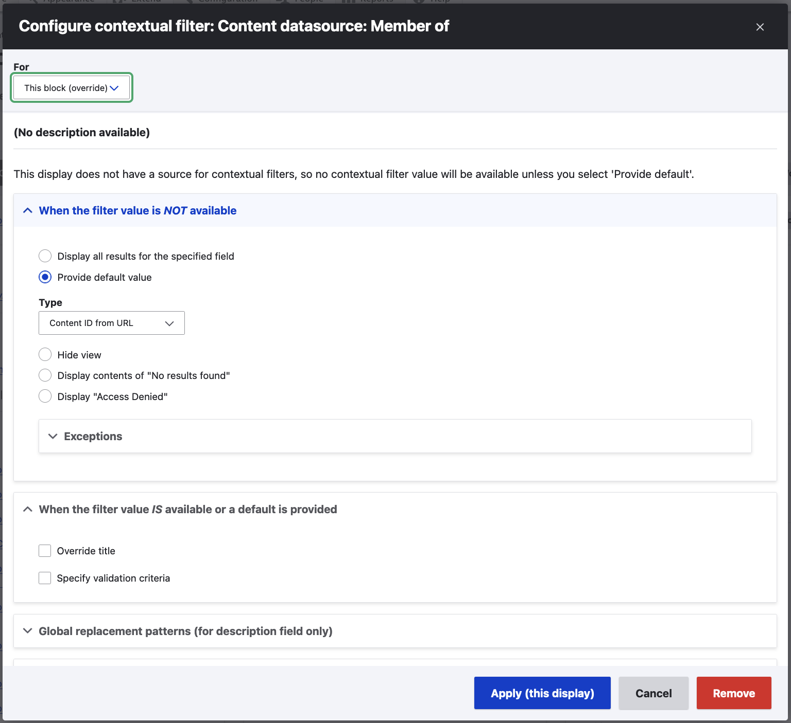

These filters are toggled by the Advanced Search block to allow the search to
include all decedents or just direct decedents (*documented below*).

### Paging

The paging options specified here can have an affect on the pager block
(*documented below*).

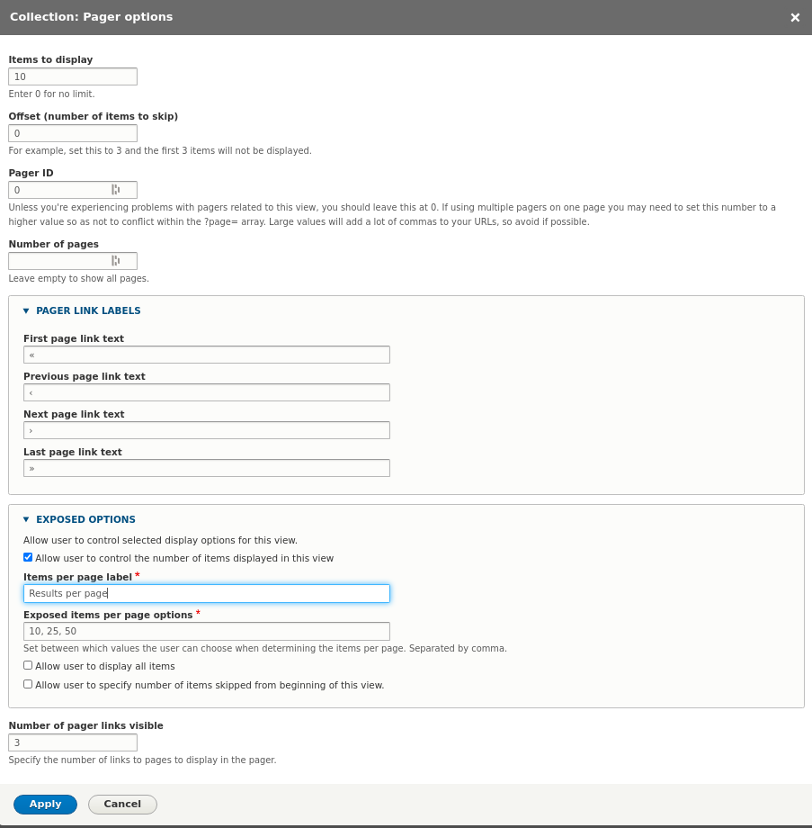

### Sorting

Additional the fields listed as `Sort Criteria` as `Exposed` will be made
available in the pager block (*documented below*).

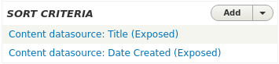

## Configure Facets

The facets can be configured at `admin/config/search/facets`. Facets are linked
to a **Source** which is a **Search API View Display** so it will be typically
to have to duplicate your configuration for a given facet across each of the
displays where you want it to show up.

### Include / Exclude Facets

To be able to display exclude facet links as well as include links in the facets
block we have to duplicate the configuration for the facet like so.

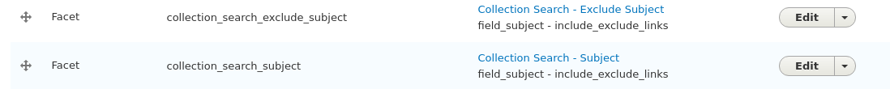

Both the include / exclude facets must use the widget
`List of links that allow the user to include / exclude facets`

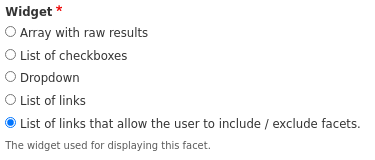

The excluded facet also needs the following settings to appear and function
correctly.

The `URL alias` must match the same value as the include facet except it must be
prefixed with `~` character that is what links to the two facets to each other.

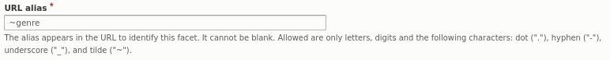

And it must also explicitly be set to exclude:


You may also want to enable `Hide active items` and `Hide non-narrowing results`
for a cleaner presentation of facets.

## Configure Blocks

For each block type:

- Facet
- Pager
- Advanced Search

There will be **one block** per `View Display`. The block should be limited to
only appear when the view it was derived from is also being displayed on the
same page.

This requires configuring the `visibility` of the block as appropriate. For
collection based searches be sure to limit the display of the Facets block to
the models you want to display the search on, e.g:

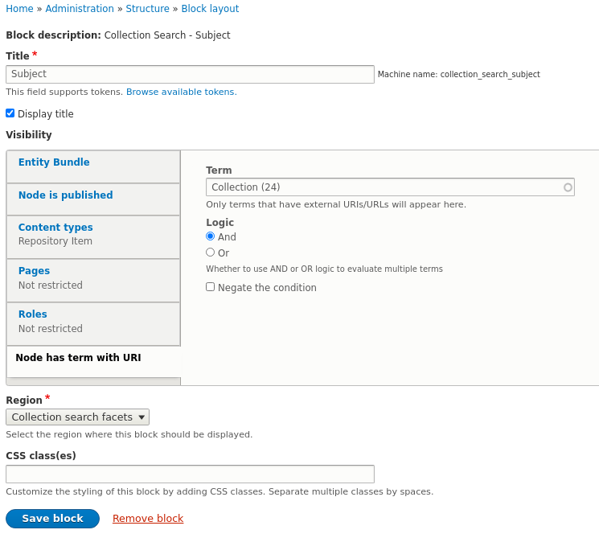

### Advanced Search Block

For any valid search field, you can drag / drop and reorder the fields to
display in the advanced search form on. The configuration resides on the block
so this can differ across views / displays if need be. Additionally if the View
the block was derived from has multiple contextual filters you can choose which
one corresponds to direct children, this will enable the recursive search
checkbox.

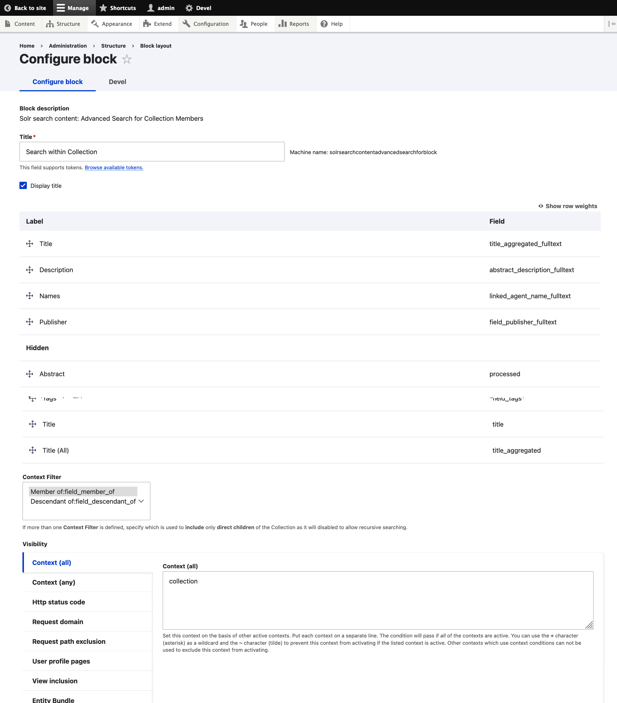

> N.B. Be aware that the Search views [Exposed Form](#exposed-form) can have an
> affect on the function of the
> [Advanced Search Block](#advanced-search-block). Please refer to that section
> to learn more.

## Documentation

Further documentation for this module is available on the
[Islandora 8 documentation site](https://islandora.github.io/documentation/).

## Troubleshooting/Issues

Having problems or solved a problem? Check out the Islandora google groups for
a solution.

- [Islandora Group](https://groups.google.com/forum/?hl=en&fromgroups#!forum/islandora)
- [Islandora Dev Group](https://groups.google.com/forum/?hl=en&fromgroups#!forum/islandora-dev)

## Maintainers

Current maintainers:

- [Nigel Banks](https://github.com/nigelgbanks)

## Sponsors

- LYRASIS

## Development

If you would like to contribute, please get involved by attending our weekly
[Tech Call](https://github.com/Islandora/documentation/wiki). We love to hear
from you!

If you would like to contribute code to the project, you need to be covered by
an Islandora Foundation
[Contributor License Agreement](http://islandora.ca/sites/default/files/islandora_cla.pdf)
or
[Corporate Contributor License Agreement](http://islandora.ca/sites/default/files/islandora_ccla.pdf).
Please see the [Contributors](http://islandora.ca/resources/contributors) pages
on Islandora.ca for more information.

We recommend using the
[islandora-playbook](https://github.com/Islandora-Devops/islandora-playbook) to
get started.

## License

[GPLv2](http://www.gnu.org/licenses/gpl-2.0.txt)
