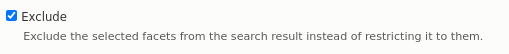

# Islandora Advanced Search <!-- omit in toc -->

- [Introduction](#introduction)
- [Feature and Advantages](#features-and-advantages)
- [Requirements](#requirements)
- [Installation](#installation)
- [Configuration](#configuration)
- [Configuring Solr](#configuring-solr)
- [eDismax Search](#edismax-search)
- [Configure Collection Search](#configure-collection-search)
- [Configure Views](#configure-views)
  - [Exposed Form](#exposed-form)
  - [Collection Search](#collection-search)
  - [Paging](#paging)
  - [Sorting](#sorting)
  - [Search Highlighting](#search-highlighting)
  - [Result Summary](#result-summary)
<!--- - [Configure Facets](#configure-facets)
  - [Include / Exclude Facets](#include--exclude-facets) --->
- [Configure Blocks](#configure-blocks)
  - [Advanced Search Block](#advanced-search-block)
  - [Search Block (NEW)](#search-block-new)
- [Documentation](#documentation)
- [Troubleshooting/Issues](#troubleshootingissues)
- [Maintainers](#maintainers)
- [Sponsors](#sponsors)
- [Development](#development)
- [License](#license)


## Introduction
The Advanced Search module provides keyword search, field search, boolean search, and search within collections and sub collections. It provides a pager UI component that allows the user to set the number of items to show, select sort criteria and display style (grid or list). It provides a global search block, which redirects the search query to a search page. It also enables the use of Ajax with views (powered by Solr), search blocks, facets, and search results.


## Features and Advantages

The module provides Boolean search, enables you to use AND, OR or NOT options to helps expanding or narrowing your search parameters.

<table>
<tbody>
<tr>
<td>&nbsp;</td>
<td>
<p><strong>Standard Query Parser</strong></p>
</td>
<td>
<p><strong>The Extended DisMax (eDismax) Query Parser&nbsp;</strong></p>
</td>
</tr>
<tr>
<td>
<p><span style="font-weight: 400;">Use</span></p>
</td>
<td>
<p><span style="font-weight: 400;">If&nbsp; Edimax is turned off in configuration, the &ldquo;Standard Query Parser&rdquo; is used.</span></p>
</td>
<td>
<p><span style="font-weight: 400;">Edismax is enabled by default, but can be turned off in configuration (/admin/config/search/advanced).&nbsp;</span></p>
</td>
</tr>
<tr>
<td>
<p><span style="font-weight: 400;">Capacity</span></p>
</td>
<td>
<ul>
<li style="font-weight: 400;"><span style="font-weight: 400;">Search a content field</span></li>
</ul>
</td>
<td>
<ul>
<li style="font-weight: 400;"><span style="font-weight: 400;">Search a content field</span></li>
<li style="font-weight: 400;"><span style="font-weight: 400;">Search across all of the fields which are indexed to Solr in Search API configuration.&nbsp;</span></li>
</ul>
</td>
</tr>
<tr>
<td>
<p><span style="font-weight: 400;">Search</span></p>
</td>
<td>
<p><span style="font-weight: 400;">Content indexed into a string field</span></p>
<ul>
<li style="font-weight: 400;"><span style="font-weight: 400;">Search returns on an exact field match (case sensitive)</span></li>
</ul>
<br />
<p><span style="font-weight: 400;">Content indexed into a full-text field</span></p>
<ul>
<li style="font-weight: 400;"><span style="font-weight: 400;">Search returns on single words or phrases (words in order), and is case insensitive.&nbsp;</span></li>
</ul>
</td>
<td>
<p><span style="font-weight: 400;">Content indexed into a string field</span></p>
<ul>
<li style="font-weight: 400;"><span style="font-weight: 400;">Search returns on an exact field match (case sensitive)</span></li>
</ul>
<br />
<p><span style="font-weight: 400;">Content indexed into a full-text field</span></p>
<ul>
<li style="font-weight: 400;"><span style="font-weight: 400;">&ldquo;Bounded&rdquo; searches return exact phrase matches, replicating the standard query parser features.</span></li>
<li style="font-weight: 400;"><span style="font-weight: 400;">Case insensitive</span></li>
<li style="font-weight: 400;"><span style="font-weight: 400;">Support for word searching in any order.</span></li>
<li style="font-weight: 400;"><span style="font-weight: 400;">Syntax for wildcards and other search features available (described in table below)</span></li>
</ul>
</td>
</tr>
</tbody>
</table>

Use the following syntaxes (eDismax ONLY) to increase Search acuracy is provided below:

<table>
<tbody>
<tr>
<td>
<p><strong>Operator</strong></p>
</td>
<td>
<p><strong>Usage</strong></p>
</td>
<td>
<p><strong>Example</strong></p>
</td>
</tr>
<tr>
<td>
<p><span style="font-weight: 400;">AND</span></p>
</td>
<td>
<p><span style="font-weight: 400;">Narrow down your search to include results that contain both search terms</span></p>
</td>
<td>
<p><span style="font-weight: 400;">orientation AND games</span></p>
</td>
</tr>
<tr>
<td>
<p><span style="font-weight: 400;">OR</span></p>
</td>
<td>
<p><span style="font-weight: 400;">Broaden your search to include results that contain either search term</span></p>
</td>
<td>
<p><span style="font-weight: 400;">students OR undergraduates</span></p>
</td>
</tr>
<tr>
<td>
<p><span style="font-weight: 400;">NOT</span></p>
</td>
<td>
<p><span style="font-weight: 400;">Narrow your search by excluding certain words or phrases</span></p>
</td>
<td>
<p><span style="font-weight: 400;">orientation NOT games</span></p>
</td>
</tr>
<tr>
<td>
<p><span style="font-weight: 400;">Asterisk (*)</span></p>
</td>
<td>
<p><span style="font-weight: 400;">Replaces the asterisk with multiple characters. Use to search for multiple beginnings, middles, and endings of words.</span></p>
</td>
<td>
<p><span style="font-weight: 400;">librar*&nbsp;</span></p>
<br />
<p><span style="font-weight: 400;">will include results like:</span></p>
<ul>
<li style="font-weight: 400;"><span style="font-weight: 400;">librar</span><strong>y</strong></li>
<li style="font-weight: 400;"><span style="font-weight: 400;">librar</span><strong>ies</strong></li>
<li style="font-weight: 400;"><span style="font-weight: 400;">librar</span><strong>ian</strong></li>
</ul>
</td>
</tr>
<tr>
<td>
<p><span style="font-weight: 400;">Question Mark (?)</span></p>
</td>
<td>
<p><span style="font-weight: 400;">Replaces the question mark with a single character. Use to search for multiple beginnings, middles, and endings of words.</span></p>
</td>
<td>
<p><span style="font-weight: 400;">?est</span></p>
<br />
<p><span style="font-weight: 400;">will include results like:</span></p>
<ul>
<li style="font-weight: 400;"><strong>T</strong><span style="font-weight: 400;">est</span></li>
<li style="font-weight: 400;"><strong>P</strong><span style="font-weight: 400;">est</span></li>
<li style="font-weight: 400;"><strong>W</strong><span style="font-weight: 400;">est</span></li>
</ul>
<br />
<p><span style="font-weight: 400;">Will not include:</span></p>
<ul>
<li><strong>Cont</strong><span style="font-weight: 400;">est</span></li>
</ul>
</td>
</tr>
<tr>
<td>
<p><span style="font-weight: 400;">Tilde (~)</span></p>
</td>
<td>
<p><span style="font-weight: 400;">Use to make your search &lsquo;fuzzy&rsquo; or search for synonyms and alternate spellings.&nbsp;</span></p>
<br />
<p><span style="font-weight: 400;">Only works for Keyword search.</span></p>
</td>
<td>
<p><span style="font-weight: 400;">Shaun~</span></p>
<br />
<p><span style="font-weight: 400;">will include results like:</span></p>
<ul>
<li style="font-weight: 400;"><span style="font-weight: 400;">Shaun</span></li>
<li style="font-weight: 400;"><span style="font-weight: 400;">Sean</span></li>
<li style="font-weight: 400;"><span style="font-weight: 400;">Shawn</span></li>
</ul>
</td>
</tr>
<tr>
<td>
<p><span style="font-weight: 400;">Quotation Marks (&ldquo;&rdquo;)</span></p>
</td>
<td>
<p><span style="font-weight: 400;">Use quotation marks to search for a specific word or phrase.</span></p>
</td>
<td>
<p><span style="font-weight: 400;">&ldquo;alumni golf tournament&rdquo;</span></p>
</td>
</tr>
</tbody>
</table>
<p>&nbsp;</p>


## Requirements

Advanced Search requires an installation of Solr, as its syntax is Solr-specific.
The Advanced Search blocks also utilize the Facets API, therefore they only work on Views where Facets are enabled.

The following requirements (Drupal modules) will be downloaded automatically by Composer:

- [facets](https://www.drupal.org/project/facets)
- [search_api_solr](https://www.drupal.org/project/search_api_solr)

You do not need to use Islandora, however the instructions below for setting up search within a collection 
(and optionally, its subcollections) use an pattern that is used by Islandora whereby nodes are organized 
in a hierarchy using an Entity Reference field (typically called "Member Of" / `field_member_of`) on a node
that accepts other nodes as values. If you are using Advanced Search and want to make use
of "Search Sub-collections" then you will need to set up such a field on your content type(s).

## Installation

This module is part of the [Islandora Starter Site](https://github.com/Islandora-Devops/islandora-starter-site), which is a full Drupal site setup that includes
Solr, and automatically sets up the views and facets required for Advanced Search to work. 

To download and enable just this module, use the following from the command line:

```bash
composer require drupal/advanced_search
drush en advanced_search
```

## Configuration

This module will make the following blocks available for every _display_
of a Search API view:
* Advanced Search Block
* Pager Block

This module also provides a block called "Search" that you can place and configure as a global search block.

You can configure these blocks to show up on pages with their respective views using Drupal's Block interface. 

You can set the following configuration at
`/admin/config/search/advanced`:


## Configuring Solr

Please review
[Islandora Documentation](https://islandora.github.io/documentation/user-documentation/searching/)
before continuing. The following assumes you already have a working Solr and the
Drupal Search API setup.

## Extended Dismax (eDismax) Search

Read the [Drupal.org documentation on Solr Query Parsers](https://www.drupal.org/docs/contributed-modules/search-api-solr/solr-query-parsers) to find more detail about
eDismax Search in Drupal.

You can enable Extended Dismax search on this module's configuration page at
`admin/config/islandora/advanced_search`. This will affect all Advanced Search
and Search blocks provided by this module.

## Configure Search Fields for Collection Search

See "Requirements" for a discussion of the use of `field_member_of`.

In this section we set up fields in our Solr index (using Search API).
The first Search API field ("Member of") indexes a node's parent(s) based
on the Drupal field `field_member_of`, and the second ("Descendant of")
indexes a node's parents and its parents' parents. This second field's 
recursive behaviour is achieved by using Search API's "Index hierarchy" 
processor.

First ensure that your hierarchy field (assumed for convenience to be `field_member_of`)
is indexed at `admin/config/search/search-api/index/[your default index]/fields`. If
not, add the field using the "Add field" button. When you find "Member of (field_member_of)",
click the "Add" button - do not delve into the child properties under "(+)". 
We will assume that the Search API field's name is also "Member of". The field type
should be "Integer".

Next, create a second Search API field, exactly the same as the first field 
except for its name, so we can tell them apart. We'll call this one "Descendant of". 


Then, under the Processors tab (`admin/config/search/search-api/index/[your default index]/processors`)
enable the checkbox for `Index hierarchy` and at the bottom of the page, setup the processor
to index hierarchy for "Descendant of" (but not "Member of").


This "Descendant of" field now contains a list of all its ancestors, so can
be used as a contextual filter on views, thereby allowing the view to display all 
descendants of a given node. 

See the section below, "Collection search", to finish configuring your site
for collection and sub-collection search.

> N.B. You may have to re-index to make sure the field is populated.

## Configure Views

Detailed instruction on the configuration of views is outside of the scope of this document.
Please read the [Drupal Documentation](https://www.drupal.org/docs/8/core/modules/views), as
well as the
[Search API Documentation](https://www.drupal.org/docs/contributed-modules/search-api).

To use the Advanced Search module, you will need to create at least one view that
is based on Search API and uses Solr. However, do NOT add the "Fulltext search"
filter, despite that being the "usual" way of setting up a Search view. All 
fulltext searching (and fielded searching) will be handled by blocks provided 
by this module.

### Exposed Form

Solr views allow the user to configure an exposed form (_optionally as a
block_). This form / block is **different** from the
[Advanced Search Block](#advanced-search-block). This module does not make any
changes to the form, but this form can cause the Advanced Search Block to not
function if configured incorrectly.

The Advanced Search Block requires that if present the Exposed forms
`Exposed form style` is set to `Basic` rather than `Input Required`. As
`Input Required` will prevent any search from occurring unless the user puts an
additional query in the Exposed form as well.


### Collection Search

This module's "Advanced Search" block can be set up on a 
"collection" (or, generically, on hierarchical entities
that can contain other entities). This block allows the user
to select whether they want the search to include sub-collections.


The following instructions describe how to set up this feature.

First, in your Search API view, set up **two** contextual filters:

1. "Member of" (Direct descendants only)
2. "Descendant of" (All descendants)


Both of these filters are configured the exact same way. The only configuration
to set is "When the filter value is NOT available" then "Provide default value". 
Under Type, select "Content ID from URL".


These two contextual filters are used by the Advanced Search block to
expose the toggle to search direct descendants or all descendants
(documented under "Advanced Search Block", below).

### Paging

The paging options specified here can have an affect on the pager block
(*documented below*).


### Sorting

Additional the fields listed as `Sort Criteria` as `Exposed` will be made
available in the pager block (*documented below*).


### Search Highlighting

1. Add Search Excerpt to the Advanced Search View.
    - Navigate to `/admin/structure/views/view/advanced_search`. In the `Fields` section, click `Add`, then select `Search Excerpt`.'
    
    
    
2. Turn on Search API highlight processor
    - Navigate to `/admin/config/search/search-api` > Edit Index > Processors > Enable Highlight processor. 
    
    
    
    - At the bottom of the form, under Processor Settings > Highlight > Select `Create excerpt`.
    
    
    
3. Configure Solr Server.
    - Navigate to `/admin/config/search/search-api` > Edit Server > Configure Solr backend > Advanced > Select `Retrieve highlighted snippets`.
    
    

### Result Summary

In your view, in the `Header` section, clikc `Add`, then search and select for "Result summary".


Then, paste the following code to `Display` textarea in `Configure Header: Global: Result summary`

````
<div id="ajax-page-summary" class="pager__summary">Displaying @start - @end of @total</div>
````


<!--- ## Configure Facets

The facets can be configured at `admin/config/search/facets`. Facets are linked
to a **Source** which is a **Search API View Display** so it will be typically
to have to duplicate your configuration for a given facet across each of the
displays where you want it to show up.

### Include / Exclude Facets

To be able to display exclude facet links as well as include links in the facets
block we have to duplicate the configuration for the facet like so.


Both the include / exclude facets must use the widget
`List of links that allow the user to include / exclude facets`


The excluded facet also needs the following settings to appear and function
correctly.

The `URL alias` must match the same value as the include facet except it must be
prefixed with `~` character that is what links to the two facets to each other.


And it must also explicitly be set to exclude:



You may also want to enable `Hide active items` and `Hide non-narrowing results`
for a cleaner presentation of facets.
--->
## Configure Blocks

For each block type:

- Facet
- Pager
- Advanced Search

There will be **one block** per `View Display`. The block should be limited to
only appear when the view it was derived from is also being displayed on the
same page.

This requires configuring the `visibility` of the block as appropriate. For
collection based searches be sure to limit the display of the Facets block to
the models you want to display the search on, e.g:


### Advanced Search Block

For any valid Search API field, you can drag / drop and reorder the fields to
display in the advanced search form on. The configuration resides on the block
so this can differ across views / displays if need be. 

If the view this block is attached to has *two* exposed filters, then you can 
choose which one corresponds to direct descendants. This will enable the 
"Include Sub-Collections" search checkbox on the Advanced Search block.


> N.B. Be aware that the Search views [Exposed Form](#exposed-form) can have an
> affect on the function of the
> [Advanced Search Block](#advanced-search-block). Please refer to that section
> to learn more.

### Search Block (NEW)

To associate this simple search block to a Advanced Search Result Page view,
you can select its machine name in the dropdown list. With that, this form
will redirect to the view with search parameters.

You can also change the search form's appearance by changing the default label,
placeholder text for the search text field, and search button.


## Documentation

Further documentation for this module is available on the
[Islandora 8 documentation site](https://islandora.github.io/documentation/).

## Troubleshooting/Issues

Having problems or solved a problem? Check out the Islandora google groups for
a solution.

- [Islandora Group](https://groups.google.com/forum/?hl=en&fromgroups#!forum/islandora)
- [Islandora Dev Group](https://groups.google.com/forum/?hl=en&fromgroups#!forum/islandora-dev)

## Maintainers

Current maintainers:

- [Nigel Banks](https://github.com/nigelgbanks)

## Sponsors

- LYRASIS

## Development

If you would like to contribute, please get involved by attending our weekly
[Tech Call](https://github.com/Islandora/documentation/wiki). We love to hear
from you!

If you would like to contribute code to the project, you need to be covered by
an Islandora Foundation
[Contributor License Agreement](http://islandora.ca/sites/default/files/islandora_cla.pdf)
or
[Corporate Contributor License Agreement](http://islandora.ca/sites/default/files/islandora_ccla.pdf).
Please see the [Contributors](http://islandora.ca/resources/contributors) pages
on Islandora.ca for more information.

We recommend using the
[islandora-playbook](https://github.com/Islandora-Devops/islandora-playbook) to
get started.

## License

[GPLv2](http://www.gnu.org/licenses/gpl-2.0.txt)

